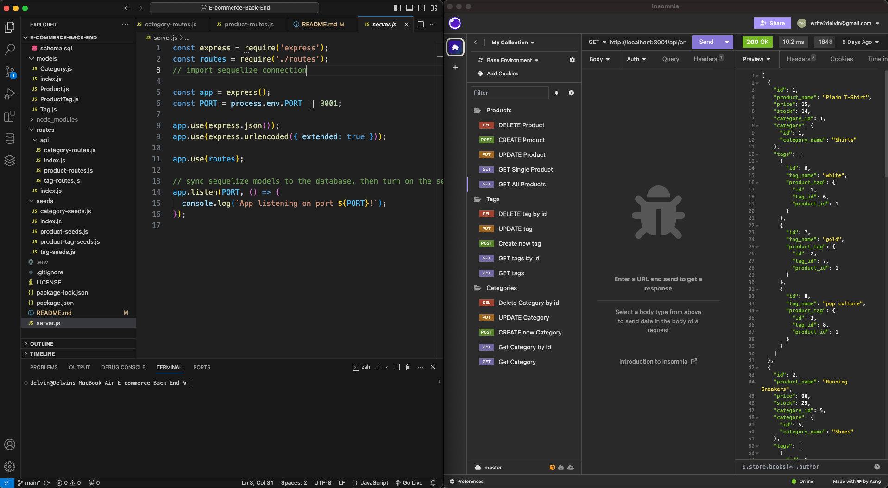

# E-commerce-Back-End

[](https://opensource.org/licenses/MIT)

## Description

This is a online store back end application using Express.js API and Sequelize to connect to the MySQL database. User's can use GET, POST, PUT, and DELETE routes to display and manipulate data in the users database.

## Table of Contents

* [Installation](#installation)

* [Usage](#usage)

* [Walkthrough](#walkthrough)

* [Credits](#credits)
  
* [License](#license)

* [Contributing](#contributing)

* [Questions](#questions)

## Installation

To install the necessary dependencies, run the following command:

```md
npm i
```

## Usage 

Open the main folder in integrated terminal and install the dependencies once done update the .env.example file name to .env and add the username and password to your database. Next step create the data base with the schema.sql file in the db folder with the following command:

```md
source schema.sql
```

 Next seed the db with necessary data or use index.js in seeds folder for trial data. 

 ```md
run seeds/index.js
```

 Run the server.js to start the project.

 ```md
node server.js 
```
OR
 ```md
npm start
```

Use Insomnia to test http://localhost:3001 with the following route end points API GET, POST, PUT, and DELETE routes for categories, products, and tags, ensuring successful creation, updating, and deletion of data in the database.



## Walkthrough

Find below walkthrough video link:


## Credits

N/A

## License

This project is licensed under the MIT license.

## Contributing

Anyone is free to contribute

## Questions

If you have any questions about the repo, open an issue or contact me directly at write2delvin@gmail.com. You can find more of my work at [delve-in](http://github.com/delve-in/).

